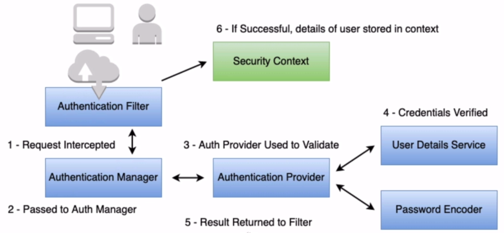

# In memory authentication

## Spring Security Authentication Process

- Authentication Filter: A filter for a specific authentication type in den spring security filter chain (basic auth, remember me cookie, etc.)
- Authentication Manager: Standard API interface used by filter
- Authentication Provider: The implementation of authentication (in memory, database, etc.)
- User Details Service: Service to provide information about user
- Password Encoder: Service to encrypt and verify passwords
- Security Context: Holds details about authenticated entity
